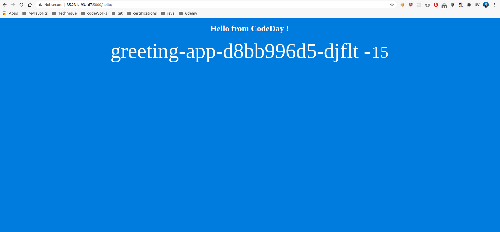
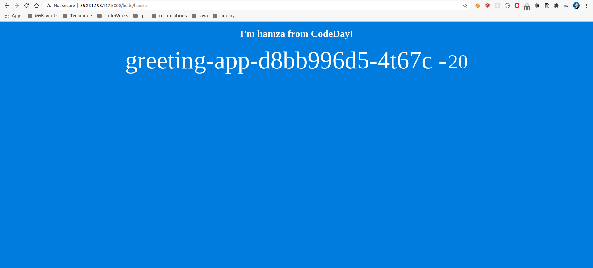
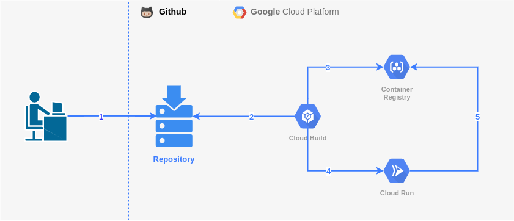

Motivation
===

Workshop to get familiar with **Google Cloud Build** core concepts  

Build your app
===

* Install Python

* Check the Python install

    ```bash
    python --version
    ```
* Install Pip

    * Update your system dependencies
        ```bash
        sudo apt update
        ```
    * Intall pip
        ```bash
        sudo apt install python3-pip
        ```
    * Check the Pip installation
        ```bash
        pip3 -V
        pip3 --version
        ```

* Install Flask

    * Install flask using pip
        ```bash
        pip3 install flask
        ```
    * Check the Flask installation
        ```bash
        flask --version
        ```

* Clone the following project

    [Gtihub Link](https://github.com/codeworks-secops/gcp-cloud-build)

* What about our Application ?

    - The goals of our sample greeting application are multiple : 
 
        - Say `Hello from CodeDay!` when the `/hello` route is invoked
        
        - Say `I'm hamza from CodeDay!` when the `/hello/hamza` route is invoked
        
        - Display an increment counter each time we visit one of the previous routes

* Some screenshots !

    * Route `/hello`

        

    * Route `/hello/<name>`

        

* Run the app in your local machine
    
    * Go to the **gcp-cloud-build** project location
        ```bash
        cd PATH_TO_YOUR_LOCAL_REPOSITORY/gcp-cloud-build
        ```

    * Export FLASK_APP environment variable to tell the terminal, the application to work with
        ```bash
        export FLASK_APP=app/app.py
        ```
    * Run the Flask application
        ```bash
        flask run
        ```
    * Check url access (on terminal or browser) 
        ```bash
        http://localhost:5000
        ```

        ```bash
        curl http://localhost:5000
        ```

Architecture
===

* Google Drive 

    [Open here](https://app.diagrams.net/#G1Rv2v0LdO8NnDPH_ZkkR2-fBFLGKx5fmi)

* Screenshot

    

Initialize Tooling
===

- Install Google Cloud SDK
    
    * [Official install docs](https://cloud.google.com/sdk/docs/install)
    
    * Make sure that Python is installed in your machine

    * Download the latest version
        ```bash
        curl -O https://dl.google.com/dl/cloudsdk/channels/rapid/downloads/google-cloud-sdk-319.0.0-linux-x86.tar.gz
        ```
    * Unzip the archive
        ```bash
        tar zxvf google-cloud-sdk-319.0.0-linux-x86
        ```
    * Launch the **instal.sh** script
        ```bash
        ./google-cloud-sdk/install.sh
        ```
    * Verify your local installation
        ```bash
        ./google-cloud-sdk/install.sh --help
        ```
Create a new GCP Project
===
* Get the billing accounts list

    ```bash
    gcloud alpha billing accounts list
    ```

* Get the Organisation ID

    ```bash
    ORGANISATION_ID=$(gcloud organizations describe codeworks.fr --format=json | jq '.name' | cut -f 2 -d '/' | sed 's/"//g')
    ```
* Name the project

    ```bash
    # Replace <FIRSTNAME-LASTNAME> with your own value
    PROJECT_ID=codeworks-<FIRSTNAME-LASTNAME>-cloud-build-workshop 
    
    # Here's an example
    PROJECT_ID=codeworks-hamza-elyaaqoubi-cloud-build-workshop
    ```
* Create new project

    ```bash
    gcloud projects create ${PROJECT_ID} --organization=${ORGANISATON_ID}
    ```

* Get the project number

    ```bash
    PROJECT_NUMBER=$(gcloud projects describe $PROJECT_ID --format='value(projectNumber)')
    ```

* Link the project to the billing account

    ```bash
    gcloud alpha billing accounts projects link ${PROJECT_NUMBER} --account-id=0150EE-171E17-3E357F
    ```

* Inspects

    * From your terminal
        ```bash
        gcloud projects list
        ```

    * From the Google Cloud Console

Init GCP configuration
===

* Configure the gcloud tool to match account / project / zone to use from scratch
    ```bash
    gcloud init
    ```
* Display zones list
    ```bash
    gcloud compute zones list
    ```
* Another init !! to init the compute zone
    ```bash
    gcloud init
    ```

* Checl all of the configuration
    ```bash
    gcloud config list
    ```

Enable APIs
===

* Services available to the project to enable. This list will include any services that the project has already enabled.
    
    ```bash
    gcloud services list --available
    ```
    
* Enable Cloud Build service

    ```bash
    gcloud services enable cloudbuild.googleapis.com 
    ```
* enable Container Registry service

    ```bash
    gcloud services enable containerregistry.googleapis.com 
    ```

Configure IAM permissions
====

Cloud Build requires **Cloud Run Admin** and **IAM Service Account User** permissions before it can deploy an image to Cloud Run.

- Grant the **Cloud Run Admin** role to the **Cloud Build** service account, so it will have permissions to deploy the Cloud Run service.

    ```bash
    gcloud projects add-iam-policy-binding $PROJECT_ID \
        --member=serviceAccount:$PROJECT_NUMBER@cloudbuild.gserviceaccount.com \
        --role=roles/run.admin
    ```

- Grant the **IAM Service Account User** role to the **Cloud Build** service account for the Cloud Run runtime service account. So the Cloud Run service may be configured to allow access from unauthenticated users.

    ```bash
    gcloud iam service-accounts add-iam-policy-binding \
        $PROJECT_NUMBER-compute@developer.gserviceaccount.com \
        --member=serviceAccount:$PROJECT_NUMBER@cloudbuild.gserviceaccount.com \
        --role=roles/iam.serviceAccountUser
    ```

Configure our Cloud Build Pipeline
====

* Open the **cloudbuild.yaml** manifest file located in the root of the project

* What do you think ? 

Setup the Cloud Build Trigger
===

* Use the GCP web-based Console

* Connect a Github Repository

Trigger builds
===

* Commit your changes

* Push your changes

Check the GCP Console
===

* Cloud Container Registry

* Cloud Build 

* Cloud Run

Access the deployed application
===

* Pick the URL from the Cloud Run Console

Clean-up all resources
===

* Delete the deployed Cloud Run service
    
    ```bash
    gcloud beta run services list
    
    gcloud beta run services delete SERVICE_NAME
    ```

* Delete the Container Registry saved images

    ```bash
    gcloud container images list

    gcloud container images delete IMAGE_NAME
    ```

* Delete the Cloud Build configured triggers


* Disconnect any connected repositories